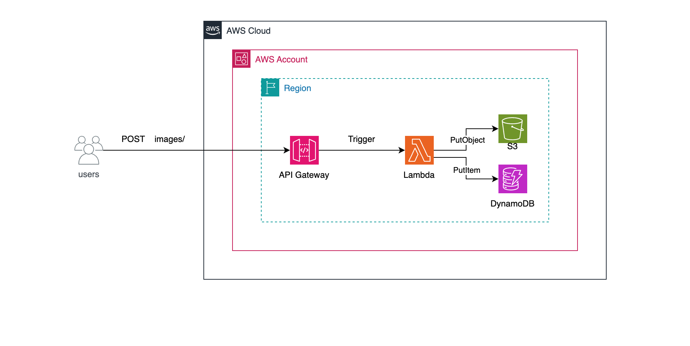

# Serverless Image Processor API

A serverless REST API built with **C# 14**, **.NET 10**, and **Native AOT** for synchronous image processing. Built to simulate a cloud computing and file processing environment, this project serves as an engineering case study to explore cloud-native provision patterns, specifically integrating **AWS API Gateway**, **AWS Lambda**, **Amazon S3**, and **Amazon DynamoDB** using **Terraform** for Infrastructure as Code (IaC).

The primary focus of this application is not on complex business logic, but rather on automated provisioning, orchestrating managed services, and mastering the AWS ecosystem (via LocalStack). It is a case study designed to make architectural concepts tangible for cloud maturity, handling network routing, strict IAM permissions, and distributed storage.

## Table of Contents

- [Prerequisites](#prerequisites)
- [How to Run](#how-to-run)
- [Project Structure](#project-structure)
- [Architecture & Design Principles](#architecture--design-principles)
- [Known Limitations & Pragmatic Trade-offs](#4-known-limitations--pragmatic-trade-offs)

## Prerequisites

Ensure you have the following installed to run this project efficiently:

- **[.NET 10 SDK](https://dotnet.microsoft.com/en-us/download/dotnet/10.0)** (or later)
- **[Terraform](https://developer.hashicorp.com/terraform/install)**
- **[Docker](https://www.docker.com/)** (Required to run LocalStack)
- **[Amazon Lambda Tools](https://docs.aws.amazon.com/lambda/latest/dg/csharp-package-cli.html)**
- **API Client:** [Postman](https://www.postman.com/) or [Insomnia](https://insomnia.rest/).

## How to Run

### 1. Clone the Repository

```bash
git clone https://github.com/kauatwn/tf-dotnet-lambda-s3-dynamodb.git
```

### 2. Start the Local Cloud Environment

Spin up **LocalStack** to simulate the AWS cloud environment (S3, DynamoDB, API Gateway, and IAM) locally without incurring costs.

```bash
docker-compose up -d
```

### 3. Navigate to the Environment Directory

```bash
cd infra/environments/dev
```

### 4. Initialize Terraform

This command downloads the required providers and sets up the local backend state.

```bash
terraform init
```

### 5. Plan the Infrastructure

Before applying, it is a best practice to review the execution plan to see exactly what Terraform will provision. We output this plan to a file to ensure predictable deployments.

```bash
terraform plan -out=tfplan

```

### 6. Provision the Infrastructure

Apply the generated execution plan. This step will also automatically compile the C# Native AOT binary and provision all local cloud resources.

```bash
terraform apply tfplan

```

> [!TIP]
> Terraform will output both the dynamically generated `api_url` and `api_id` at the end of the process. Because LocalStack perfectly mocks AWS APIs, deploying this to a real AWS production environment requires zero C# code changes — only an update to the Terraform provider credentials.

### 7. Simulating an Upload

Perform a `POST` request to the API to upload an image. The payload must be a JSON object containing the file metadata and the image encoded in Base64.

- **Endpoint:** Use the format `http://127.0.0.1:4566/_aws/execute-api/<api-id>/local/images` (replace `<api-id>` with the ID outputted by Terraform).
- **Headers:** `Content-Type: application/json`
- **Body:**

```json
{
  "FileName": "avatar.png",
  "ContentType": "image/png",
  "Base64Image": "iVBORw0KGgoAAAANSUhEUgAAAAEAAAABCAQAAAC1HAwCAAAAC0lEQVR42mP8/x8AAwMCAO+ip1sAAAAASUVORK5CYII="
}
```

_The API will return a 200 OK status containing the `ImageId` and the simulated S3 URI._

## Project Structure

The application code follows **Clean Architecture / Ports and Adapters** principles, isolating the core domain logic from AWS SDK infrastructure details, while the Terraform code is structured into modular blocks.

```plaintext
tf-dotnet-lambda-s3-dynamodb/
├── infra/
│   ├── environments/dev/         # Environment-specific tfvars and main execution
│   └── modules/                  # Reusable IaC Modules
│       ├── api/                  # API Gateway resources
│       ├── compute/              # Lambda, IAM Roles, and Policies
│       └── storage/              # S3 and DynamoDB
├── src/ImageProcessor.Lambda/
│   ├── Core/                     # Interfaces and Use Cases
│   ├── DTOs/                     # Request/Response contracts
│   ├── Infrastructure/           # AWS SDK implementations (Adapters)
│   ├── Models/                   # Domain entities
│   └── Function.cs               # Lambda Entrypoint
└── tests/
    ├── ImageProcessor.UnitTests/         # Isolated Domain and Use Case tests via Moq
    └── ImageProcessor.IntegrationTests/  # End-to-end Handler and DB testing via Testcontainers
```

## Architecture & Design Principles

This repository prioritizes **infrastructure automation** and **execution speed**, utilizing a synchronous serverless pattern combined with aggressive compilation optimizations.

### 1. Event-Driven, Synchronous Architecture


_Figure 1: Synchronous event-driven flow from HTTP POST request to image storage and metadata persistence._

- **The Event & Payload:** The client produces an HTTP POST event containing the image payload encoded in Base64.
- **The Trigger:** **AWS API Gateway** intercepts this request and acts as the trigger, invoking the Lambda function.
- **The Consumer:** **AWS Lambda** executes the C# code, decoding the payload and orchestrating the downstream services (S3 for object storage, DynamoDB for metadata).

### 2. Design Patterns & Optimizations

| Feature                    | Usage Scenario                                                                                 | Implementation                                                                |
| -------------------------- | ---------------------------------------------------------------------------------------------- | ----------------------------------------------------------------------------- |
| **Native AOT**             | Eliminating .NET runtime initialization overhead to solve the Serverless "Cold Start" problem. | `PublishAot=true` in `.csproj`                                                |
| **Infrastructure as Code** | Reproducible environments, disaster recovery, and local cloud parity.                          | `Terraform` & `LocalStack`                                                    |
| **Least Privilege IAM**    | Security by design, ensuring the compute layer only accesses designated resources.             | `aws_iam_role_policy` strictly defining `s3:PutObject` and `dynamodb:PutItem` |
| **Dependency Inversion**   | Mocking cloud dependencies for unit testing without relying on AWS SDKs directly.              | `IStorage` and `IImageRepository` interfaces                                  |

### 3. CI/CD & End-to-End Validation

The project includes a mature **GitHub Actions** pipeline designed for complete infrastructure and code validation. On every push, the pipeline:

1. Provisions a detached LocalStack container.
2. Executes `terraform apply` to compile the C# Native AOT binary (overriding architecture variables to ensure Linux x86_64 compatibility) and creates all simulated AWS resources.
3. Parses the dynamic API Gateway URL and executes a real HTTP `cURL` request to validate the entire integration flow (API -> Lambda -> S3 & DynamoDB).

### 4. Known Limitations & Pragmatic Trade-offs

This project is an engineering case study focused on synchronous APIs. It introduces specific pragmatic trade-offs that must be evaluated for enterprise-grade production:

- **Payload Size Limits (The Base64 Trade-off):** Due to AWS API Gateway limits (10MB) and Lambda synchronous invocation limits (6MB), combined with the ~33% overhead of Base64 encoding, this architecture is strictly limited to small images. It is ideal for avatars and thumbnails, but unsuitable for high-resolution media.
- **Architectural Evolution:** For large-scale streaming or heavy files, a synchronous approach decoding Base64 in memory directly correlates to higher RAM usage and potential timeouts. The architectural evolution for this design would be implementing **S3 Pre-signed URLs** (where the Lambda only authorizes the upload and the client sends the file directly to S3) coupled with an asynchronous Event Notification to save metadata.
